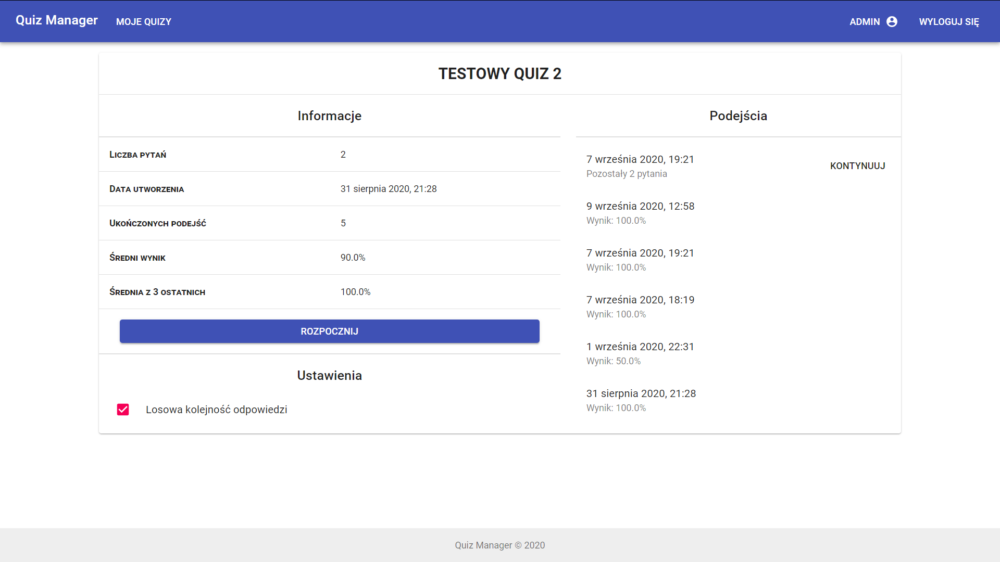
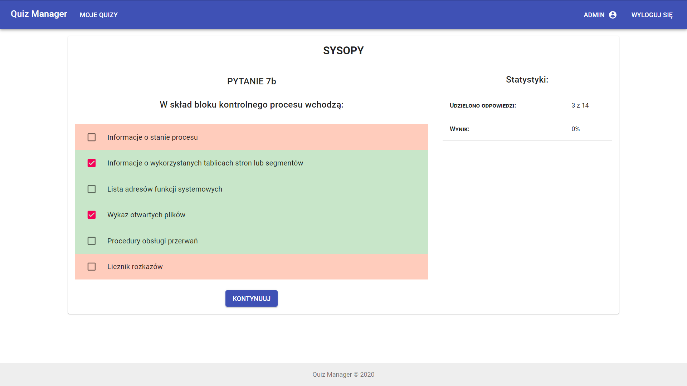

# Quiz Manager

Web application to create, save and solve multiple choice tests. Compatible with Prober's Drill System quiz format (PDS).

Features:
- Easy to use Material Design UI.
- Easy quiz creation - just paste quiz in PDS format. It willbe recognized automatically.
- Optional answers random shuffle. So that you don't learn answers by their order.
- Track your results. Compare stats from 3 last attempts to all summary.
- Easily continue unfinished quiz attempt. Just select from attempt list.

Application is in **first aplha version** yet, so its functionality is very limited. 

The main destination of project was to learn new web technologies, so the code is still not the highest quiality and I still improve it. 

## Technical details

### Backend

- Node.js & Express.js
- MongoDB database
- Authentication based on JWT.

### Frontend

- React.js
- Material UI library

## Deploy

It is required to set the following environment variables:

```
- PORT=<express-js-port>
- DB_STRING=<database-connection-string>
- CORS_ORIGIN=<http://your-site-here.com>
- SECRET=<secret-key-used-by-node>
```

## Screenshots






## Author

[Jacek Nitychoruk](https://github.com/Jck-eN)